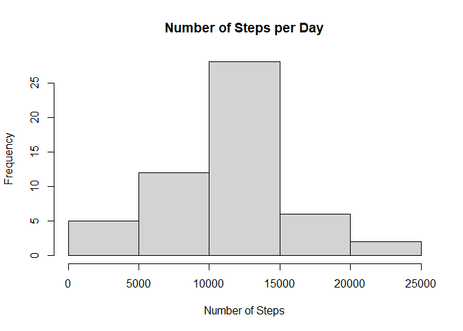
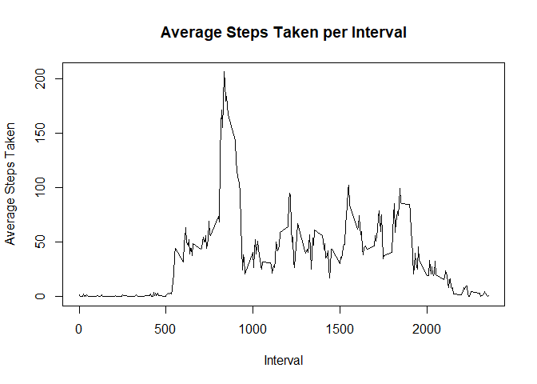
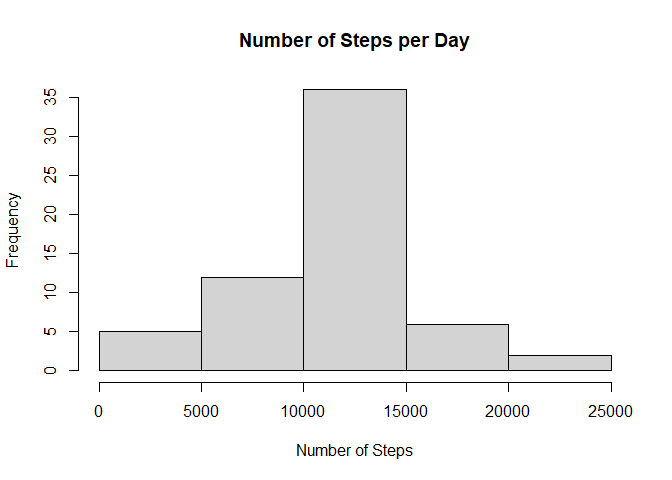
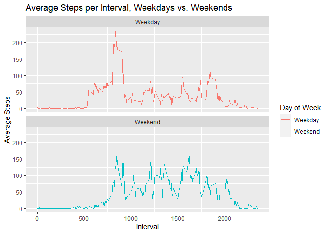

```r
library(knitr)
library(tidyverse)
```

```
## ── Attaching packages ─────────────────────────────────────── tidyverse 1.3.2 ──
## ✔ ggplot2 3.4.0      ✔ purrr   0.3.5 
## ✔ tibble  3.1.8      ✔ dplyr   1.0.10
## ✔ tidyr   1.2.1      ✔ stringr 1.4.1 
## ✔ readr   2.1.3      ✔ forcats 0.5.2
```

```
## Warning: package 'ggplot2' was built under R version 4.2.2
```

```
## ── Conflicts ────────────────────────────────────────── tidyverse_conflicts() ──
## ✖ dplyr::filter() masks stats::filter()
## ✖ dplyr::lag()    masks stats::lag()
```

```r
opts_chunk$set(echo = TRUE, fig.keep = "all", fig.path = "figures/", dev = "png")
```

## Loading and preprocessing the data


```r
#path <- getwd()
#unzip <- unzip("activity.zip", exdir = path)
```

```r
activity <- read.csv("activity.csv")
activity$date <- as.Date(activity$date, "%Y-%m-%d")
```

## What is mean total number of steps taken per day?


```r
stepsDay <- aggregate(steps ~ date, activity, sum)
hist(stepsDay$steps,
     xlab = "Number of Steps",
     main = "Number of Steps per Day")
```

<!-- -->

The **mean** and **median** number of steps per day:


```r
mean(stepsDay$steps)
```

```
## [1] 10766.19
```

```r
median(stepsDay$steps)
```

```
## [1] 10765
```

## What is the average daily activity pattern?


```r
stepsInterval <- aggregate(steps ~ interval, activity, mean)
plot(steps ~ interval, 
     data = stepsInterval, 
     type = "l",
     xlab = "Interval",
     ylab = "Average Steps Taken",
     main = "Average Steps Taken per Interval")
```

<!-- -->

5-Minute interval which, on average, contains the **maximum** number of steps:


```r
stepsInterval[which.max(stepsInterval$steps),]$interval
```

```
## [1] 835
```

## Imputing missing values

Number of intervals with missing steps:


```r
sum(is.na(activity$steps))
```

```
## [1] 2304
```

Missing intervals filled with average


```r
avgSteps <- stepsInterval$steps[match(activity$interval, stepsInterval$interval)]
newActivity <- transform(activity, steps = ifelse(is.na(activity$steps), avgSteps, activity$steps))
```


```r
newStepsDay <- aggregate(steps ~ date, newActivity, sum)

hist(newStepsDay$steps,
     xlab = "Number of Steps",
     main = "Number of Steps per Day")
```

<!-- -->

The **mean** and **median** number of steps per day:


```r
mean(newStepsDay$steps)
```

```
## [1] 10766.19
```

```r
median(newStepsDay$steps)
```

```
## [1] 10766.19
```

The **difference** in **mean** and **median** after imputing NA values:


```r
mean(newStepsDay$steps)-mean(stepsDay$steps) # mean
```

```
## [1] 0
```

```r
median(newStepsDay$steps)-median(stepsDay$steps) # median
```

```
## [1] 1.188679
```

## Are there differences in activity patterns between weekdays and weekends?

```r
activity <- activity %>% mutate(day = weekdays(date)) %>% 
      mutate(aweekend = ifelse(day == "Saturday" | day == "Sunday", "Weekend", "Weekday"))
activity$aweekend <- as_factor(activity$aweekend)
```


```r
avgStepsWkday <- aggregate(steps ~ interval + aweekend, activity, mean)

wkday <- ggplot(avgStepsWkday, aes(x = interval, y = steps, color = aweekend)) +
      geom_line() +
      facet_wrap(~aweekend, nrow = 2, ncol = 1) +
      xlab("Interval")+
      ylab("Average Steps")+
      ggtitle("Average Steps per Interval, Weekdays vs. Weekends")+
      scale_color_discrete(name = "Day of Week")
wkday
```

<!-- -->
